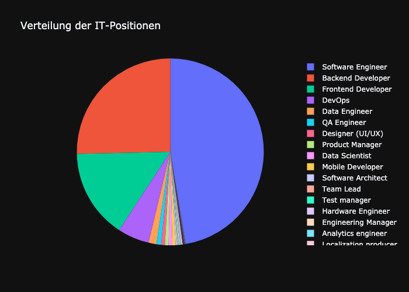
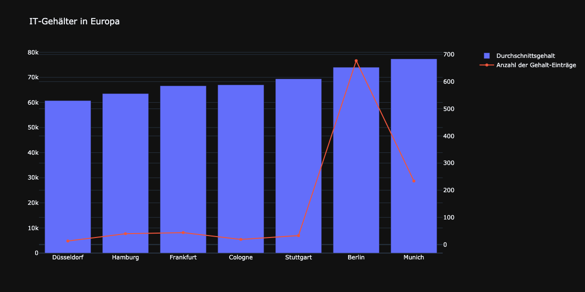
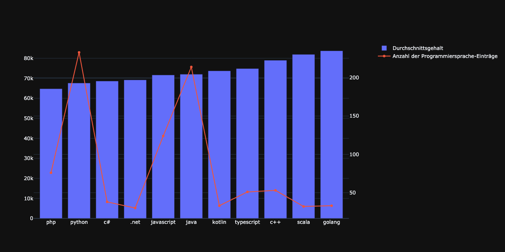
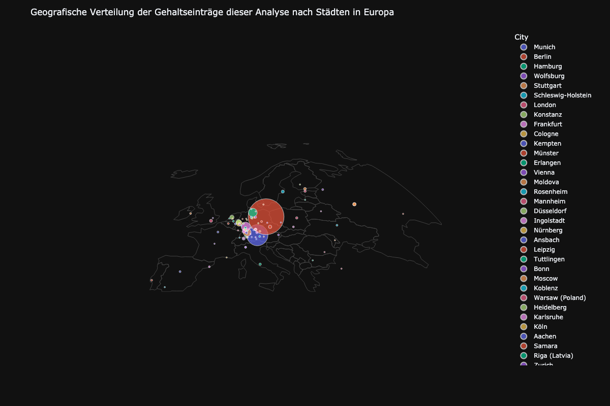

# IT Salary Analysis in Europe (2020)

## 📌 Project Overview
This project performs a comprehensive analysis of IT salary data in Europe using Python with Plotly for interactive visualizations. The dataset used is the "IT Salary Survey EU 2020" from Kaggle and includes various data cleaning, processing, and visualization techniques.

## 📊 Sample Results

### Distribution of IT Positions in Europe


### Average Salaries by City


### Average Salaries by Programming Languages


### Geographical Distribution of Salaries


## 🚀 Project Objectives
- Load and clean the dataset, removing irrelevant columns and outliers.
- Analyze the distribution of IT positions in Europe.
- Explore geographical distribution of salary data by city.
- Calculate and visualize the average salaries by city and programming language.
- Provide clear and interactive data visualizations using Plotly.

## 🗂️ Project Structure
```
├── IT Salary Survey EU 2020.csv          # Original dataset
├── cities_coordinates.csv               # Coordinates for city mapping
├── salary_analysis.ipynb                # Jupyter Notebook for the full analysis
├── README.md                            # Project documentation (this file)
└── requirements.txt                     # Libraries requirements for this project
```

## 📊 Data Cleaning and Preparation
- Removed irrelevant columns (e.g., timestamp, experience in Germany).
- Removed outliers (salaries above 1,000,000 EUR).
- Standardized city names and corrected misspellings.
- Filtered out non-European cities.

## 📈 Exploratory Data Analysis (EDA)
1. Distribution of IT Positions
   - Displayed the most common IT positions in Europe.
2. Geographical Distribution
   - Mapped salary data to European cities using a scatter geo-plot.
3. Average Salaries by City
   - Calculated and visualized the average salaries for each city.
4. Average Salaries by Programming Language
   - Analyzed and visualized average salaries for various programming languages.

## 🚀 Improvement Box
- [ ] Use Docker to containerize the project for easy deployment.
- [ ] Create a frontend website with Streamlit for user interaction and data visualization.
- [ ] Allow users to filter salary data by career type (e.g., Data Engineer, Software Engineer).
- [ ] Implement relative and absolute formulas to rate the living standard based on salary and city.

## 🚀 How to Run
1. Clone the repository:
   ```bash
   git clone https://github.com/notsufferbutbutter/IT_salary_Europa_analysis.git
   ```
2. Install the required Python libraries:
   ```bash
   pip install pandas plotly
   ```
3. Run the analysis notebook:
   ```bash
   jupyter notebook salary_analysis.ipynb
   ```

## 💡 Author
Created by notsufferbutbutter.
